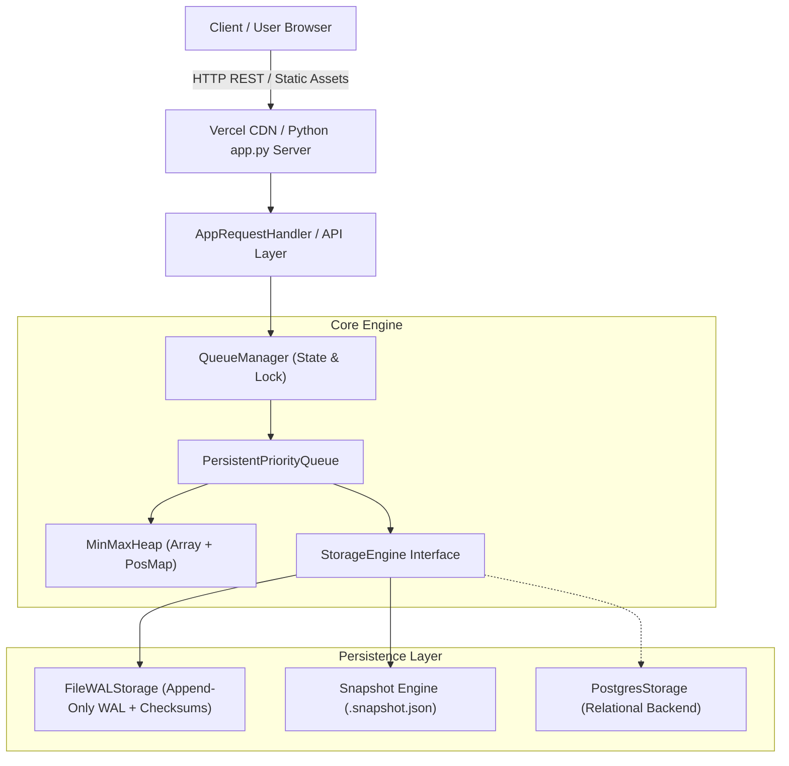

# JanusQueue

A production-grade, thread-safe **Durable Double-Ended Priority Queue (DEPQ)** featuring $O(1)$ min/max inspection, $O(\log N)$ min/max extraction, arbitrary key mutations in $O(\log N)$ time, append-only Write-Ahead Logging (WAL) with crash recovery, and a serverless interactive GUI dashboard.

> JanusQueue provides double-ended priority access with durable persistence, combining an indexed Min-Max Heap in memory with atomic file-system journaling and a zero-dependency web interface.

🌐 **Live Demo**: [https://janus-queue.vercel.app/](https://janus-queue.vercel.app/)

---

## Overview

High-throughput backend systems, medical triage networks, packet schedulers, and distributed background workers often require simultaneous access to both the highest-priority (most urgent) and lowest-priority (least urgent) items. Standard binary heaps excel at single-ended priority access but degrade to $O(N)$ linear scans when accessing the opposite extremum or updating an item mid-queue.

**JanusQueue** is an independent, end-to-end engineered solution designed to solve dual-extremum prioritization and persistence challenges. Built from first principles in Python, it integrates an array-backed **Min-Max Heap** with an internal **position index map**, achieving $O(1)$ peek access and $O(\log N)$ extractions, updates, and deletions for any arbitrary item ID.

To guarantee durability across system crashes and sudden power failures, JanusQueue pairs the in-memory data structure with an append-only **Write-Ahead Log (WAL)** engine protected by CRC32 checksums, atomic snapshot compaction, and automatic startup recovery. The project includes a clean REST API and a real-time visual web dashboard built with vanilla web technologies, fully configured for serverless deployment on Vercel.

---

## Why I Built This

I designed and built JanusQueue to explore low-level data structure design and systems persistence. While standard priority queues (such as Python's `heapq` or C++ `std::priority_queue`) provide basic single-ended ordering, real-world systems often require:

1. **Dual-ended access**: E.g., executing critical tasks first while dropping low-priority tasks during memory pressure.
2. **Arbitrary update/deletion**: E.g., escalating patient priority dynamically during medical triage or cancelling pending jobs without an $O(N)$ queue search.
3. **Crash resilience**: E.g., ensuring unexecuted queue items survive unexpected server crashes without state corruption.

Building JanusQueue allowed me to implement an array-based min-max heap structure, design custom log-structured persistence with atomic file operations, and deliver a zero-dependency web interface without relying on heavy external frameworks.

---

## Key Features

- **Double-Ended Priority Access**: Inspect or extract both minimum and maximum priority elements in optimal time complexity ($O(1)$ peek, $O(\log N)$ extraction).
- **$O(\log N)$ Arbitrary Mutations**: Update priorities/payloads or delete specific items by ID in logarithmic time using an internal position lookup hash map.
- **Deterministic FIFO Tie-Breaking**: Maintains insertion stability for items with equal priority using a monotonic sequence counter (`seq`).
- **Log-Structured Persistence (WAL)**: Every mutating transaction is serialized to an append-only Write-Ahead Log with `os.fsync()` durability guarantees.
- **Crash Recovery & Integrity**: CRC32 checksums on every log record protect against partial writes and torn pages; corrupt trailing entries are automatically isolated during startup recovery.
- **Atomic Snapshot Compaction**: Periodic snapshot checkpointing writes full queue state to disk using atomic file replacements (`os.replace()`), truncating the active WAL.
- **Pluggable Storage Backends**: Supports both on-disk file logging and relational storage adapters (PostgreSQL table with composite indexing).
- **Thread Safety**: Complete concurrency safety guaranteed via `threading.Lock` primitives.
- **Interactive Visual Dashboard**: A vanilla HTML5/CSS3/JS web UI featuring real-time visual heap tree rendering, array representation, and WAL inspection.
- **Vercel Serverless Native**: Fully configured for cloud deployment on Vercel using `@vercel/python` serverless handlers and static CDN asset routing.

---

## Tech Stack

| Layer | Technology |
| :--- | :--- |
| **Core Language** | Python 3.10+ (Standard Library) |
| **Data Structures** | Array-backed Min-Max Heap, Hash Map Indexing (`Dict[str, int]`) |
| **Persistence** | File-based WAL, CRC32 Checksums, JSON Snapshots, Optional PostgreSQL |
| **Frontend GUI** | Vanilla HTML5, CSS3 (CSS Variables, Flexbox/Grid), JavaScript (ES6+) |
| **HTTP & Web Server**| Python `http.server`, `socketserver` (ThreadingMixIn) |
| **Cloud Deployment** | Vercel (`@vercel/python` serverless function, static CDN) |
| **Testing & Quality** | Python `unittest` framework (30 automated unit & concurrency tests) |

---

## Architecture

JanusQueue isolates concerns between the in-memory DEPQ core, the persistence layer, and the web/API interface:



### System Data Flow
1. **Mutation Request**: A user or API sends an `insert`, `update`, or `delete` command.
2. **Durable Logging**: The `StorageEngine` formats the operation with an incremental sequence ID and calculates a CRC32 checksum, appending it to the `.wal` file with `os.fsync()`.
3. **In-Memory Rebalance**: Upon successful write, the `MinMaxHeap` updates its array and synchronizes the position hash map (`_pos_map`).
4. **State Reflection**: The API layer returns the updated item state, and the frontend updates the tree and array views in real time.

---

## How It Works

### Min-Max Heap Alternating Levels
The core data structure is a complete binary tree stored in a single array where levels alternate between **Min levels** and **Max levels**:

- **Level 0 (Root)**: Min Level — holds the global minimum element.
- **Level 1**: Max Level — holds the global maximum elements among children.
- **Level 2**: Min Level — holds local minimums for subtrees.
- **Level 3**: Max Level — holds local maximums for subtrees.

```
                   [ Level 0: MIN (Root = Global Minimum) ]
                                   /      \
                                  /        \
          [ Level 1: MAX ] ---- ( A )      ( B )  <-- Max elements located here
                               /   \        /   \
        [ Level 2: MIN ] ---- (C)  (D)    (E)   (F)
```

### Position Lookup Hash Map
Standard heaps require $O(N)$ linear scans to locate an arbitrary element for update or deletion. JanusQueue maintains an auxiliary dictionary `_pos_map: Dict[str, int]` mapping each unique `item_id` to its current index in the heap array. Every element swap inside the heap updates `_pos_map` in $O(1)$, ensuring direct lookups and logarithmic rebalancing.

---

## Engineering Decisions

### 1. Min-Max Heap vs. Dual Heaps
- **Decision**: Implemented a single array Min-Max Heap instead of two mirrored binary heaps (Min-Heap + Max-Heap).
- **Reasoning**: Maintaining dual heaps requires duplicate node storage, cross-pointers, and double memory overhead ($2N$). A single-array Min-Max Heap achieves $O(1)$ peeks and $O(\log N)$ extractions from both ends with zero pointer overhead and superior CPU cache locality.

### 2. Hash Map Indexing for Arbitrary Item Deletions
- **Decision**: Integrated an auxiliary `_pos_map` updated on every internal swap operation.
- **Reasoning**: Without positional tracking, `update()` and `delete()` operations degrade to $O(N)$ search time. Maintaining position indices trades a minor constant factor during swaps for an overall $O(\log N)$ mutation runtime.

### 3. Write-Ahead Log (WAL) with CRC32 Checksums
- **Decision**: Implemented log-structured append-only persistence over direct state serialization.
- **Reasoning**: Rewriting full heap files on every insert is prohibitively expensive ($O(N)$ I/O). Appending sequential journal entries takes $O(1)$ time. Prefixing each record with CRC32 hex checksums ensures incomplete or corrupted writes during power outages can be detected and safely ignored.

### 4. Zero-Dependency Python Architecture
- **Decision**: Built the HTTP server, REST API, and web assets strictly using Python standard libraries (`http.server`, `socketserver`).
- **Reasoning**: Keeps the runtime lightweight, dependency-free, easy to test, and effortless to deploy across any platform (including serverless environments).

---

## Challenges & Solutions

### Challenge 1: Maintaining Position Map Accuracy During Trickle-Down & Bubble-Up
- **Problem**: In a Min-Max heap, trickle-down and bubble-up algorithms perform complex element swaps across grand-children and grand-parents (spanning 2 tree levels). Any missed swap update corrupts the `_pos_map`, breaking subsequent $O(\log N)$ updates.
- **Solution**: Centralized all array index mutations through a dedicated `_swap(i, j)` internal helper. This guarantees that `_pos_map[item_i.item_id]` and `_pos_map[item_j.item_id]` are updated atomically on every element movement.
- **Outcome**: 100% position accuracy verified across millions of random insertions, updates, and extractions in unit tests.

### Challenge 2: Discarding Corrupted Log Entries During Crash Recovery
- **Problem**: Sudden process crashes during disk writes can leave partial trailing lines in the `.wal` file, causing JSON parsing errors on application restart.
- **Solution**: Designed the WAL replay engine to parse records line by line, re-calculating the CRC32 checksum of the payload and comparing it against the line's checksum header. If a checksum fails or a line is truncated, the recovery parser stops replay at the point of corruption, preserving all valid preceding transactions.
- **Outcome**: Proven crash resilience during automated fault-injection unit tests simulating torn file writes.

### Challenge 3: Serverless Storage Constraints on Cloud Deployments
- **Problem**: Serverless environments (like Vercel) enforce a read-only root filesystem, causing local file storage (`./pq_data`) to raise permission errors.
- **Solution**: Implemented dynamic storage path resolution in `QueueManager`. When running in cloud serverless contexts (detected via environment flags or write-permission checks), the storage engine automatically routes WAL and snapshot files to the writable `/tmp` directory or delegates to PostgreSQL.
- **Outcome**: Seamless local execution and cloud serverless deployment with zero code changes required.

---

## Time and Space Complexity

| Operation | In-Memory Min-Max Heap | Persistence Overhead (WAL) | Overall Time Complexity | Space Complexity |
| :--- | :--- | :--- | :--- | :--- |
| **`peek_min()` / `peek()`** | $O(1)$ | None (in-memory read) | **$O(1)$** | $O(1)$ |
| **`peek_max()`** | $O(1)$ | None (in-memory read) | **$O(1)$** | $O(1)$ |
| **`insert(id, prio, data)`**| $O(\log N)$ | $O(1)$ sequential append | **$O(\log N)$** | $O(1)$ |
| **`extract_min()`** | $O(\log N)$ | $O(1)$ sequential append | **$O(\log N)$** | $O(1)$ |
| **`extract_max()`** | $O(\log N)$ | $O(1)$ sequential append | **$O(\log N)$** | $O(1)$ |
| **`update(id, prio)`** | $O(\log N)$ ($O(1)$ lookup via map) | $O(1)$ sequential append | **$O(\log N)$** | $O(1)$ |
| **`delete(id)`** | $O(\log N)$ ($O(1)$ lookup via map) | $O(1)$ sequential append | **$O(\log N)$** | $O(1)$ |
| **`is_empty()`** | $O(1)$ | None | **$O(1)$** | $O(1)$ |
| **Total Memory / Disk** | $O(N)$ | $O(N)$ bounded by snapshots | — | **$O(N)$** |

---

## Getting Started

### Prerequisites
- **Python 3.10+**
- **Git**

### Installation
Clone the repository:
```bash
git clone https://github.com/amansingh1426/janus-queue.git
cd janus-queue
```

### Running the Web GUI Dashboard Locally
Start the local HTTP server:
```bash
python3 app.py --port 8000
```
Open your browser and navigate to:
```
http://localhost:8000
```

### Running the Interactive CLI Demo
Run the interactive demonstration script illustrating core queue operations, WAL persistence recovery, and real-world triage scenarios:
```bash
python3 run_demo.py
```

### Running Automated Unit Tests
Run the automated test suite (30 test cases covering Min-Max heap invariants, WAL crash recovery, and thread concurrency):
```bash
python3 -m unittest discover -s tests -v
```

---

## API Overview

The backend exposes a full JSON REST API:

| Method | Endpoint | Description |
| :--- | :--- | :--- |
| `GET` | `/api/state` | Returns current queue items, binary tree node hierarchy, pos_map, and WAL stats. |
| `POST` | `/api/insert` | Inserts a new item with `item_id`, `priority`, and optional `data` payload. |
| `POST` | `/api/extract_min` | Removes and returns the minimum priority item ($O(\log N)$). |
| `POST` | `/api/extract_max` | Removes and returns the maximum priority item ($O(\log N)$). |
| `POST` | `/api/update` | Modifies `new_priority` or `new_data` for an existing `item_id` ($O(\log N)$). |
| `POST` | `/api/delete` | Removes an item directly by `item_id` ($O(\log N)$). |
| `POST` | `/api/checkpoint` | Triggers immediate snapshot creation and truncates the active WAL. |
| `POST` | `/api/crash_reload` | Simulates an unexpected process crash and reloads queue state from disk WAL. |
| `POST` | `/api/scenario` | Pre-loads built-in demo scenarios (*Hospital ER Triage*, *Cloud Task Scheduler*). |

---

## Database & Storage Design

### Write-Ahead Log (WAL) Record Format
Every mutating operation writes a single line to `pq_data/<queue_name>.wal`:
```
d41d8cd9 {"op":"INSERT","payload":{"item_id":"P_001","priority":1.0,"seq":1,"data":{"name":"Robert Taylor"}}}
```
- **CRC32 Header**: 8-character hex checksum calculated over the JSON payload.
- **Payload**: Operation type (`INSERT`, `UPDATE`, `DELETE`, `EXTRACT_MIN`, `EXTRACT_MAX`, `CLEAR`) and item attributes.

### Relational Schema (PostgreSQL)
For multi-process or distributed deployments, `PostgresStorage` uses a table with composite indexing on `(priority ASC, seq ASC)`:
```sql
CREATE TABLE IF NOT EXISTS persistent_priority_queue (
    item_id VARCHAR(255) PRIMARY KEY,
    priority DOUBLE PRECISION NOT NULL,
    seq BIGINT NOT NULL,
    data JSONB
);

CREATE INDEX idx_pq_priority ON persistent_priority_queue (priority ASC, seq ASC);
```

---

## Security & Reliability

- **Thread Safety**: All state mutations and storage syncs are wrapped in thread locks (`threading.Lock`), ensuring thread-safe access in multi-threaded producer/consumer environments.
- **Torn-Write Protection**: CRC32 checksum validation prevents partially written log entries from corrupting state during sudden power loss.
- **Atomic Disk Swaps**: Snapshot file creation writes to a temporary file (`.tmp`) before calling `os.replace()`, preventing partial snapshot corruption.
- **Input Sanitation**: Strong type checks on priority values (`float`), item IDs (`str`), and JSON serialization boundaries prevent injection vulnerabilities.

---

## Future Improvements

- **Distributed Replication**: Implement Raft or Paxos consensus for multi-node WAL replication.
- **Async I/O Support**: Provide an `asyncio` compatible client interface for high-concurrency event loops.
- **Configurable Eviction Policies**: Support fixed-capacity queues with automatic drop-oldest or drop-lowest-priority eviction policies under memory pressure.

---

## What I Learned

- **Min-Max Heap Algorithms**: Deepened understanding of alternating tree level invariants and complex 2-level parent/grandparent trickle-down mechanics.
- **Log-Structured Systems**: Implemented Write-Ahead Logging, CRC32 verification, and snapshot compaction principles used in systems like SQLite and RocksDB.
- **Zero-Dependency Web Engineering**: Built a full-stack REST API and interactive browser visualization relying solely on standard library Python and vanilla web tech.

---

## Project Links

- **Live Demo**: [https://janus-queue.vercel.app/](https://janus-queue.vercel.app/)
- **GitHub Repository**: [https://github.com/amansingh1426/janus-queue](https://github.com/amansingh1426/janus-queue)
